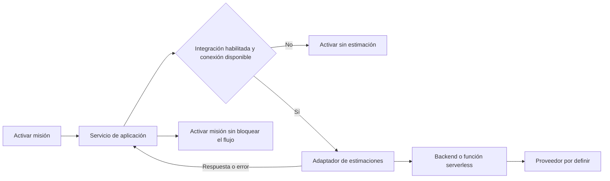

# Inventario funcional y no regresión

## Alcance

Backlog Quest administra localmente juegos, copias, partidas, misiones, cola, calendario y dispositivos. No usa backend, cuentas ni nube. Los textos visibles nunca son identificadores funcionales.

## Vistas

1. Inicio: métricas, misiones activas, próximos juegos, balance de dispositivos y actividad.
2. Cola: catálogo completo, filtros, posiciones, estados, dependencias y activación.
3. Biblioteca: búsqueda por relaciones, filtros, privacidad, creación y edición.
4. Plan: calendario generado desde reglas y preferencias, más una lista permanente de misiones activas para editar su agenda aunque no tengan días programados.
5. Historial: partidas de todos los juegos.
6. Dispositivos: catálogo con IDs estables e integridad referencial.
7. Configuración: franjas, cola, calendario, interfaz, plataformas, presentación de propiedades, temas y portabilidad.

La vista activa se conserva en `preferences.activeView`.

## Editor de juego

El editor contiene General, Copias y Partidas. General también administra el catálogo de contenidos, la fecha de disponibilidad y las dependencias que pueden bloquear el juego en la cola. Un juego nuevo recibe un ID único y una entrada al final de la cola. Puede existir sin copias ni contenidos, pero no puede activarse como misión hasta tener ambos.

Los contenidos no ocupan una pestaña independiente: se agregan, renombran, clasifican, reordenan y eliminan desde General. Misiones y partidas solo seleccionan contenidos existentes mediante un ID estable; no crean términos libres.

Una copia conserva plataforma, propiedad, dispositivos, estado, prioridad, sesión ideal, progreso entre copias y notas. La lista muestra un resumen y abre el formulario completo solo al editar. Puede eliminarse aunque una misión o partida la utilice; ambas se conservan sin la referencia.

El juego no usa un porcentaje global de progreso. El avance se expresa mediante el estado de cada partida; el punto actual, las terminaciones y las rejugadas se conservan como información histórica agregada.

La plataforma de una copia procede de un catálogo con IDs estables. La propiedad representa la forma de acceso y nunca forma parte del nombre funcional de la plataforma.

Agregado rápido muestra todas las combinaciones biblioteca/propiedad conocidas, con la más reciente primero. Elegir una crea un formulario de copia prellenado sin seleccionar dispositivos.

Una partida conserva contenido, copia, dispositivo, estado, fechas y notas. Solo puede crearse cuando el juego tiene al menos una copia y un contenido; comienza vinculada a ambos. Puede eliminarse aunque una misión la referencie; la misión se conserva y queda marcada como pendiente de vincular a una nueva partida.

## Misiones

Activar una misión vincula juego, contenido, copia, dispositivo y partida; actualiza cola/copia/contenido y crea una regla cuando existen sesiones. Cada sesión combina un día y una franja. Una misión puede usar distintas franjas durante la semana o varias el mismo día.

Dos misiones solo entran en conflicto cuando una sesión coincide tanto en día como en franja. El reemplazo nunca es silencioso: requiere confirmación y aplaza las misiones conflictivas.

Terminar cierra misión y partida, elimina calendario, actualiza progreso y contenido, registra actividad y reorganiza la cola según intención de rejugada.

Pausar, aplazar, enviar al final y abandonar conservan historial, liberan la franja y eliminan programación futura. Las acciones importantes admiten restaurar el snapshot previo mediante Deshacer.

## Cola y calendario

Cada juego aparece una sola vez en la cola, con posiciones continuas. Los estados válidos son `active`, `queued`, `paused`, `deferred`, `replay`, `replay-later`, `archived`, `low-interest`, `blocked` y `wishlist`.

El calendario se deriva de `scheduleRules`, sus `sessions`, `scheduleOverrides`, `scheduleWeeks` y `weekStartsOn`; no se codifican títulos o fechas manuales. Una misión sin sesiones permanece activa y accesible desde Plan, pero no genera bloques de calendario.

La edición agrupa las sesiones por franja. Cada franja aparece una sola vez y conserva siete activadores `L M X J V S D`; activar un día crea su sesión y desactivarlo la elimina. Se pueden agregar hasta las cuatro franjas disponibles y una franja ya agregada queda deshabilitada en las demás agrupaciones. Una agrupación sin días es temporal y no se persiste hasta activar al menos uno.

## Dispositivos

Las relaciones usan IDs (`deviceIds`, `deviceId`, `activeDeviceId`, `preferredDeviceId`). Los nombres son presentación y compatibilidad. Renombrar no rompe referencias; eliminar se bloquea mientras existan usos.

La administración del catálogo vive en esta vista, no en Configuración. La lista conserva el resumen de juegos y misiones; seleccionar una tarjeta o su acción Editar abre un formulario individual. Agregar dispositivo abre el mismo formulario con un ID nuevo y estable.

## Configuración

Todas las preferencias deben tener un efecto observable: perfiles de franjas, tamaño de Inicio, posición al aplazar, semanas, inicio de semana, vista compacta, tooltips, privacidad, confirmaciones, presentación de propiedades, temas e importación/exportación.

La vista compacta reduce relleno y separación vertical en tarjetas de Inicio y Biblioteca, bloques de misión y filas de Cola. No debe ocultar contenido, cambiar relaciones ni alterar el orden de los datos.

Cada término de propiedad puede ocultarse en las etiquetas rápidas o presentarse con un texto configurable de hasta 24 caracteres. La regla solo afecta la presentación; el valor funcional del catálogo no cambia.

Las plataformas pueden agregarse, renombrarse, desactivarse y eliminarse cuando no tienen referencias. Guardar dos con el mismo nombre las fusiona y reasigna copias y presets al ID conservado.

## Biblioteca y Cola

Biblioteca y Cola representan órdenes distintos. Cola conserva exclusivamente el orden planeado de juego; Biblioteca ofrece orden por pendientes, alfabético, prioridad o actividad reciente sin escribir posiciones en Cola. El orden predeterminado deja contenidos terminados, completados o abandonados al final y ordena cada grupo alfabéticamente.

## Misiones, copias y partidas

Una misión puede permanecer sin contenido, copia o partida vinculada después de eliminar una relación. Esas condiciones deben mostrarse como alertas diferenciadas en Inicio y Plan, y como indicadores compactos en otros resúmenes activos. Las misiones terminadas o abandonadas no requieren esa alerta.

Las alertas `Sin copia` y `Sin partida` son acciones de resolución. Abren directamente un formulario nuevo en la sección correspondiente y vinculan el registro a la misión al guardarlo. `Sin contenido` abre General para administrar el catálogo. `Sin partida` permanece deshabilitada cuando el juego todavía no tiene copia o contenido.

Eliminar una copia desacopla las misiones, partidas y preferencia de Cola relacionadas. La partida conserva sus descripciones históricas de plataforma y dispositivo. Eliminar una partida desacopla las misiones relacionadas, elimina su fila del historial editable y conserva la bitácora textual existente. Editar y guardar una misión sin partida crea una nueva; cerrar esa misión también debe crearla y vincularla, incluso cuando no exista una copia.

El control **Editar misión** permite seleccionar otro contenido existente, cambiar copia, dispositivo y agenda sin abandonar el objetivo. Desde el mismo formulario se puede abrir la administración de contenidos del juego.

## Lenguaje del dominio: Contenido

**Contenido** es una parte identificable del catálogo de un juego, por ejemplo una campaña, expansión, DLC, rejugada u objetivo personalizado. El juego es su propietario y conserva el orden del catálogo. Misión y Partida son consumidores: guardan `contentId` mientras la relación existe y una copia textual de título y tipo para explicar el historial si el contenido se elimina.

## Integración futura de estimaciones

Las estimaciones externas no forman parte de este entregable. Antes de implementarlas se debe diseñar un contrato independiente del proveedor, revisar sus condiciones de uso y evitar que la aplicación cliente conozca credenciales.

Recomendación: resolver esta capacidad como una integración opcional y reemplazable detrás de un adaptador. La activación de una misión debe seguir funcionando cuando el proveedor no esté configurado, no haya conexión o la consulta falle.

## Invariantes

- Toda referencia no vacía de una misión pertenece al mismo juego.
- Una regla siempre referencia una misión existente.
- Una sesión programada contiene un día válido de `0` a `6` y una franja existente.
- Una misma regla no contiene dos veces la misma combinación día/franja.
- Una entrada de cola siempre referencia un juego existente.
- IDs internos y etiquetas visibles están desacoplados.
- Cambiar textos de ayuda no altera claves, relaciones ni operaciones.
- Importar o normalizar nunca borra datos existentes para reconstruirlos artificialmente.
